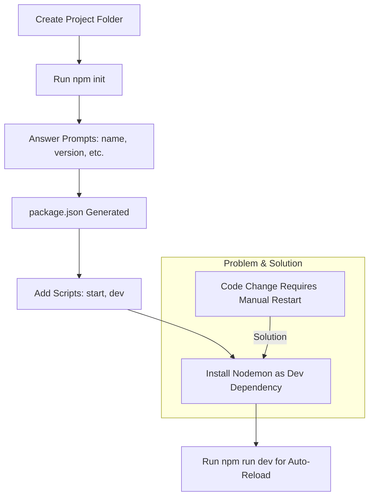
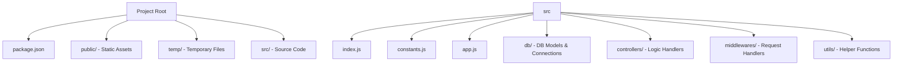
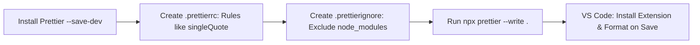

# Professional Node.js Project Setup Guide

This README provides a step-by-step guide to setting up a professional Node.js project from scratch. We'll start with project initialization and cover best practices for structure, dependencies, environment variables, and code formatting. This setup assumes you're building a server-side application (e.g., with Express and MongoDB), but it's adaptable.

We'll use tools like npm for package management, Nodemon for development efficiency, Dotenv for environment variables, and Prettier for code styling. Diagrams and flowcharts are included using Mermaid syntax (renderable on platforms like GitHub).

## Prerequisites

- Node.js installed (version 18+ recommended). Download from [nodejs.org](https://nodejs.org/).
- A code editor like VS Code.
- Git for version control (optional but recommended).

## Step 1: Initialize the Project with `npm init`

Start by creating a new directory for your project and navigating into it:

```bash
mkdir my-node-project
cd my-node-project
```

Run `npm init` to generate a `package.json` file. This command prompts you with questions to configure your project basics:

```bash
npm init
```

Answer the prompts like this (customize as needed):

- **package name**: (my-node-project) – Press Enter or enter a name.
- **version**: (1.0.0) – Press Enter.
- **description**: A brief description of your project, e.g., "A professional Node.js backend setup".
- **entry point**: (index.js) – Change to `src/index.js` if following our structure.
- **test command**: Leave blank or enter `echo "Error: no test specified" && exit 1`.
- **git repository**: Enter your repo URL if using Git.
- **keywords**: Add tags like "node", "express", "backend".
- **author**: Your name.
- **license**: (ISC) – Press Enter or choose MIT.

After answering, npm creates a `package.json` file. This file manages dependencies, scripts, and metadata.

### Understanding `package.json`

- It's the heart of your Node.js project.
- Key section: **scripts** – An object for custom commands. Example default:
  ```json
  "scripts": {
    "test": "echo \"Error: no test specified\" && exit 1"
  }
  ```
  You can add custom scripts like `"start": "node src/index.js"` or `"dev": "nodemon src/index.js"`. Run them with `npm run <script-name>`, e.g., `npm run dev`.

## Step 2: Handling Server Restarts with Nodemon

In development, if you change code (e.g., in your server file), you must manually stop (Ctrl+C) and restart the server with `node src/index.js`. This is inefficient.

**Solution**: Install **Nodemon** as a development dependency. Nodemon watches for file changes and auto-restarts the server.

### Dependencies vs. Dev Dependencies

- **Dependencies** (`npm install <package>`): Required for your app to run in production (e.g., Express, Mongoose). Installed in `dependencies` in package.json.
- **Dev Dependencies** (`npm install <package> --save-dev` or `-D`): Only needed for development (e.g., Nodemon, testing tools). Installed in `devDependencies`. They don't bloat production builds.

Install Nodemon:

```bash
npm install nodemon --save-dev
```

Update `package.json` scripts:

```json
"scripts": {
  "start": "node src/index.js",
  "dev": "nodemon src/index.js"
}
```

Now, run `npm run dev` – changes auto-reload the server!

### Setup Flowchart

Here's a Mermaid flowchart showing the initialization and Nodemon setup process:



## Step 3: Project Folder Structure

Create a clean, scalable structure:

- `public/`: For static files like images, CSS (served publicly). Discussed later for serving assets.
- `temp/`: For temporary files (e.g., uploads, caches). Discussed later for cleanup routines.
- `src/`: Core source code.
  - `index.js`: Entry point (starts the server).
  - `constants.js`: Global constants (e.g., error messages, enums).
  - `app.js`: Express app setup (routes, middleware).
  - `db/`: Database connection and models (e.g., Mongoose schemas).
  - `controllers/`: Business logic handlers (e.g., userController.js).
  - `middlewares/`: Custom middleware (e.g., auth, error handling).
  - `utils/`: Utility functions (e.g., helpers, validators).

Run these commands to create them:

```bash
mkdir public temp src src/db src/controllers src/middlewares src/utils
touch src/index.js src/constants.js src/app.js
```

### Folder Structure Diagram

Visualized with Mermaid:



(Uses discussed in later sections or as your app grows – e.g., `db/` for MongoDB integration, `controllers/` for API endpoints.)

## Step 4: Environment Variables with .env and Dotenv

Sensitive data (e.g., DB URLs, passwords) shouldn't be hardcoded. Use a `.env` file.

Create `.env` in the root:

```bash
touch .env
```

Add variables:

```
DB_URL=mongodb://localhost:27017/mydatabase
DB_PASSWORD=your_secure_password
PORT=3000
```

Install **Dotenv** to load these into `process.env`:

```bash
npm install dotenv
```

In `src/index.js`, add:

```javascript
require('dotenv').config(); // At the top
console.log(process.env.DB_URL); // Access like this
```

## Step 5: .gitignore for Excluding Files

Create `.gitignore` to prevent committing sensitive files like `.env` or `node_modules/` to Git.

Use an online generator like [gitignore.io](https://www.toptal.com/developers/gitignore) – search for "Node" and copy the template.

Command to create:

```bash
curl -sL https://www.gitignore.io/api/node > .gitignore
```

Or manually add:

```
node_modules/
.env
temp/
```

This ensures `.env` (with DB passwords) isn't pushed to GitHub.

## Step 6: Optional - Code Formatting with Prettier

For consistent code style, install **Prettier** as a dev dependency:

```bash
npm install prettier --save-dev
```

Create `.prettierrc` for config (JSON format):

```json
{
  "singleQuote": true,
  "trailingComma": "es5",
  "semi": true
}
```

Create `.prettierignore` to exclude files:

```
node_modules/
package-lock.json
```

Run Prettier: `npx prettier --write .` (formats all files).

Integrate with VS Code: Install Prettier extension and set as default formatter.

### Prettier Configuration Diagram



## Final Setup and Running

1. Install core dependencies (e.g., for Express + Mongoose):
   ```bash
   npm install express mongoose
   ```
2. In `src/index.js`: Set up your server.
3. Run `npm run dev`.

Your project is now professionally structured! Expand as needed (e.g., add routes in `app.js`, models in `db/`). For full app examples, see Node.js docs.

If issues arise, check `package.json` or run `npm install`. Happy coding! 🚀